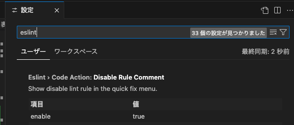

# ESLint 設定手順

以下の手順に従って、ESLintの設定を行います。

## 手順

1. プロジェクトのルートディレクトリに移動します。
2. `@typescript-eslint/eslint-plugin` パッケージをインストールします。

```sh
pnpm add -D @typescript-eslint/eslint-plugin
```

3. `eslint.config.mjs` ファイルを開きます。
4. 以下の設定を追加します。

```javascript
const eslintConfig = [
  ...compat.extends('next/core-web-vitals', 'next/typescript'),
  {
    rules: {
      '@typescript-eslint/naming-convention': [
        // 既存の設定
      ],
      semi: ['error', 'always'],
      quotes: [
        'error',
        'single',
        { avoidEscape: true, allowTemplateLiterals: true },
      ],
    },
  },
];
```

5. ファイルを保存して閉じます。
6. プロジェクトのルートディレクトリで `eslint` を実行し、設定が正しく適用されていることを確認します。

以上で設定は完了です。

## 振り返り

今回の設定変更により、以下の点が改善されました。

- TypeScriptの末尾にセミコロンを必須にすることで、コードの一貫性が向上しました。
- 文字列をシングルクォーテーションで囲うルールを追加することで、コードスタイルが統一されました。
- `@typescript-eslint/eslint-plugin` パッケージのインストールが必要であることを明記し、設定手順がより明確になりました。

これにより、プロジェクト全体のコード品質が向上し、開発者間でのコードスタイルの統一が図られました。

### 良かった点

- コードの一貫性と可読性が向上しました。
- 明確な設定手順により、新しい開発者がプロジェクトに参加しやすくなりました。
- ESLintの設定が適切に適用され、コード品質が向上しました。

### 改善点

- 今後のプロジェクトでは、設定変更の影響を事前に確認するためのテストを追加することを検討します。
- 他の開発者からのフィードバックを受けて、設定をさらに最適化することができます。
- 設定手順を自動化するスクリプトを作成し、手動での設定ミスを減らすことができます。

## VSCodeでESLintの警告を表示する方法

以下の手順に従って、VSCodeでESLintの設定に違反しているコードに対して警告を表示するように設定します。

1. VSCodeを開きます。
2. 拡張機能タブを開き、`ESLint` 拡張機能をインストールします。 識別子: dbaeumer.vscode-eslint
3. VSCodeの設定を開きます（`Cmd + ,`）。
4. 設定検索バーに `eslint` と入力し、`ESLint: Enable` を有効にします。
   

これで、VSCodeでコードを書いている際に、ESLintの設定に違反している部分に波線で警告が表示されるようになります。

## 一部のエラーを無視する方法

ESLintで一部のエラーを無視するには、以下の方法があります。

### 特定の行を無視する

特定の行のエラーを無視するには、その行の上に以下のコメントを追加します。

```javascript
// eslint-disable-next-line @typescript-eslint/naming-convention
const __filename = fileURLToPath(import.meta.url);
```

### 特定のブロックを無視する

特定のブロックのエラーを無視するには、以下のようにコメントを追加します。

```javascript
/* eslint-disable @typescript-eslint/naming-convention */
const __filename = fileURLToPath(import.meta.url);
const __dirname = dirname(__filename);
/* eslint-enable @typescript-eslint/naming-convention */
```

これにより、指定したルールのエラーを無視することができます。

## 再度振り返り

### Keep

- ESLintの設定により、コードの一貫性と可読性が向上した。
- VSCodeでのリアルタイムな警告表示により、開発効率が向上した。
- 設定手順が明確になり、新しい開発者がプロジェクトに参加しやすくなった。

### Problem

- 設定変更の影響を事前に確認するためのテストが不足している。
- 他の開発者からのフィードバックを受ける機会が少ない。
- 手動での設定ミスが発生する可能性がある。

### Try

- 設定変更の影響を確認するためのテストを追加する。
- 他の開発者からのフィードバックを積極的に受け入れ、設定を最適化する。
- 設定手順を自動化するスクリプトを作成し、手動での設定ミスを減らす。
