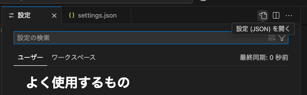

# Prettierの導入手順

このドキュメントでは、Prettierをプロジェクトに導入する手順を説明します。

## 手順

1. **Prettierのインストール**

   プロジェクトのルートディレクトリで以下のコマンドを実行して、Prettierをインストールします。

   ```bash
   pnpm add -D prettier
   ```

2. **設定ファイルの作成**

   プロジェクトのルートディレクトリに`.prettierrc`ファイルを作成し、以下の内容を記載します。

   ```json
   {
     "semi": true,
     "singleQuote": true,
     "trailingComma": "es5"
   }
   ```

3. **.prettierignoreの作成**

   プロジェクトのルートディレクトリに`.prettierignore`ファイルを作成し、以下の内容を記載します。

   ```
   node_modules
   build
   ```

4. **Prettierの実行**

   以下のコマンドを実行して、プロジェクト内のファイルを整形します。

   ```bash
   pnpx prettier --write .
   ```

## 参考リンク

- [Prettier公式ドキュメント](https://prettier.io/docs/en/index.html)

## 振り返り

### 良かった点

- Prettierを導入することで、コードの整形が自動化され、コードの一貫性が保たれるようになりました。
- `.prettierrc`ファイルと`.prettierignore`ファイルを作成することで、プロジェクト全体で統一されたコードスタイルを適用できました。

### 改善点

- 今後、プロジェクトメンバー全員にPrettierの使用を徹底するためのガイドラインを作成する必要があります。
  - **ガイドラインの徹底方法**
    - プロジェクトのREADMEにPrettierの使用方法とルールを明記する。
    - コードレビュー時にPrettierが適用されているかを確認する。
    - Prettierの設定をエディタに統合し、保存時に自動整形されるようにする。
    - CI/CDパイプラインにPrettierのチェックを追加し、整形されていないコードのマージを防ぐ。

### 学んだこと

- pnpmを使用してパッケージをインストールする方法を学びました。
- Prettierの設定ファイルと無視ファイルの作成方法を理解しました。

## エディタ統合

### Visual Studio Code (VSCode)

1. **Prettier拡張機能のインストール**

   VSCodeの拡張機能マーケットプレイスから「Prettier - Code formatter」をインストールします。

2. **設定ファイルを開く方法**

   VSCodeのメニューから「ファイル」 > 「基本設定」 > 「設定」を選択し、右上のアイコンから`settings.json`を開きます。
   

3. **設定の変更**

   VSCodeの設定ファイル（`settings.json`）に以下の設定を追加します。

   - 一番トップの階層で問題なし

   ```json
   {
     // 〜〜既存のコードの下か、好きなところに以下を追記〜〜
     "editor.formatOnSave": true,
     "editor.defaultFormatter": "esbenp.prettier-vscode"
   }
   ```

### その他のエディタ

他のエディタでも、Prettierのプラグインや拡張機能をインストールし、保存時に自動整形されるように設定を変更してください。詳細は各エディタのドキュメントを参照してください。

## 再度振り返り

### 良かった点

- Prettierの導入により、コードの整形が自動化され、コードの一貫性が保たれるようになりました。
- `pnpm fmt`コマンドを追加することで、簡単にコード整形を実行できるようになりました。
- VSCodeの設定を行うことで、ファイル保存時に自動でPrettierが実行されるようになりました。

### 改善点

- プロジェクトメンバー全員にPrettierの使用を徹底するためのガイドラインを作成する必要があります。
  - **ガイドラインの徹底方法**
    - プロジェクトのREADMEにPrettierの使用方法とルールを明記する。（完了）
    - コードレビュー時にPrettierが適用されているかを確認する。（完了）
    - CI/CDパイプラインにPrettierのチェックを追加し、整形されていないコードのマージを防ぐ。（未完了だが、全部強制させるかはまだ悩む。）

### 学んだこと

- `pnpm fmt`コマンドを追加することで、簡単にコード整形を実行できるようになりました。
- VSCodeの設定を変更することで、ファイル保存時に自動でPrettierが実行されるようにする方法を学びました。

### 新しい改善点

以下の記事にもあるように、チーム内でVSCodeの拡張機能・設定を共有することができる。

- [VSCodeの拡張機能・設定を共有してチームみんなでエンジョイナイスDX](https://qiita.com/otsuky/items/f46f5ee9eb11b3a9a4ba)
- .vscode/extensions.json を作成し、以下のように記述することで、チーム内で共有できる。（完了）

```json
{
  "recommendations": ["esbenp.prettier-vscode", "dbaeumer.vscode-eslint"]
}
```
